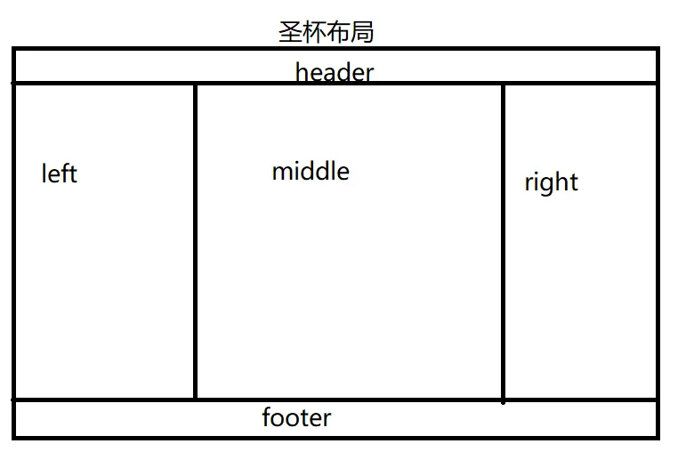

# 圣杯布局和双飞翼布局的理解和区别，并用代码实现

- 两侧宽度固定，中间宽度自适应
- 中间部分在 DOM 结构上优先，以便先行渲染
- 允许三列中的任意一列成为最高列
- 只需要使用一个额外的 div 标签
  

1. 圣杯布局：
   a) DOM 结构

```html
<body>
<div id="header"></div>
<div id="container">
  <div id="center" class="column"></div>
  <div id="left" class="column"></div>
  <div id="right" class="column"></div>
</div>
<div id="footer"></div>
</body>
```

b) CSS

```css
body {
  min-width: 550px;
}
#container {
  padding-left: 200px;
  padding-right: 150px;
}
#container .column {
  float: left;
}
#center {
  width: 100%;
}
#left {
  width: 200px;
  margin-left: -100%;
  position: relative;
  right: 200px;
}
#right {
  width: 150px;
  margin-right: -150px;
}
#footer {
  clear: both;
}
```

2. 双飞翼布局：
   a) DOM

```html
<body>
  <div id="header"></div>
  <div id="container" class="column">
    <div id="center"></div>
  </div>
  <div id="left" class="column"></div>
  <div id="right" class="column"></div>
  <div id="footer"></div>
</body>
```

b) CSS

```css
body {
  min-width: 500px;
}
#container {
  width: 100%;
}
.column {
  float: left;
}
#center {
  margin-left: 200px;
  margin-right: 150px;
}
#left {
  width: 200px;
  margin-left: -100%;
}
#right {
  width: 150px;
  margin-left: -150px;
}
#footer {
  clear: both;
}
```
